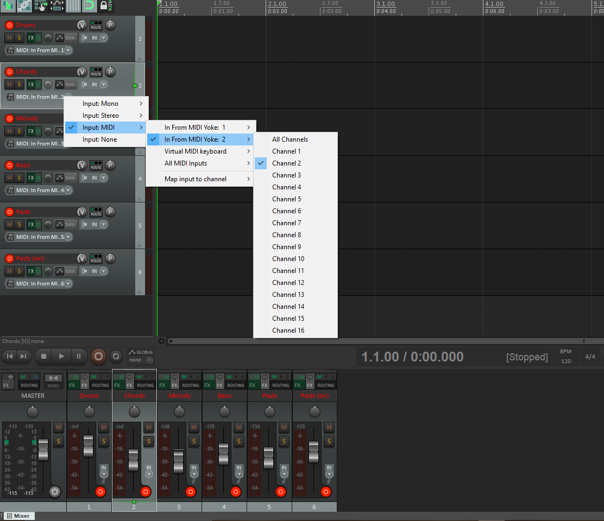

# Algorhythmic Music Generator

Generates random MIDI notes w/in constraints built on basic music theory. Built as part of Picante, a hackathon project for [Knight Hacks 2019](https://devpost.com/software/picante), the code was made originally to take input from an EEG sensor that measured stress levels and create music that

## Dependencies
- Python ver. >= 3.6
- rtmidi (Python package, "pip install python-rtmidi")
- numpy
- Virtual Ports (e.g. MIDI Yoke)
- DAW (e.g. Reaper)
- VSTs (virtual instruments to play from code)

## Virtual Ports

To send the MIDI signals to a virtual instrument on the computer, it needs to be sent through a virtual port. Windows, for whatever reason, doesn't like virtual ports, so you can set them up by using a software such as [MIDI Yoke](http://www.midiox.com/) which is what I used. By running the program, virtual ports are automatically created w/ 8 channels. Within the python code, you must then find what port you are going to use by calling `midiout.get_ports()` to show what virtual ports are available and find the index of the correct one. More can be found in rtmidi's [documentation](https://pypi.org/project/python-rtmidi/).

## DAW

To set up the DAW, set up tracks with each instrument that take input from the appropriate channel. If you're using MIDI Yoke like me and Reaper like me, you can use the .rpp file in this project, but you'll probably have to switch instruments to something you have and like. You may still have to go into preferences, enable MIDI Yoke # (port number you want to connect to w/ `midiout.open_port(index of port MIDI Yoke #)`), and reset the channels on each of the tracks starting from MIDI Yoke # > Channel 1 ... to Channel n for the number of instruments.

